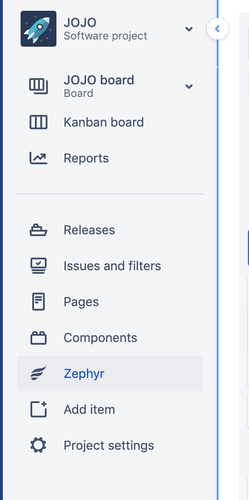
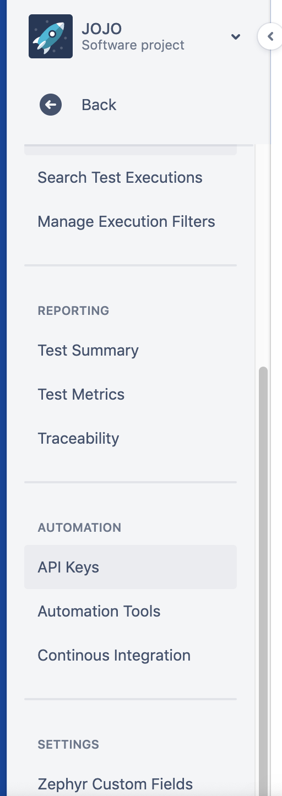
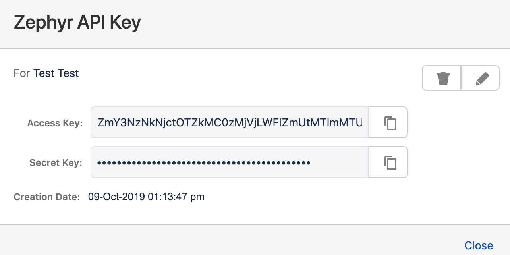
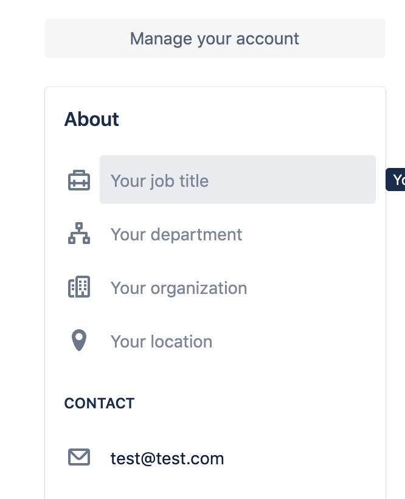
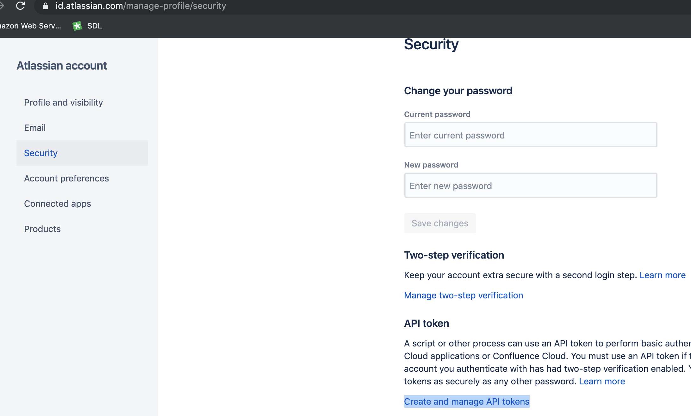
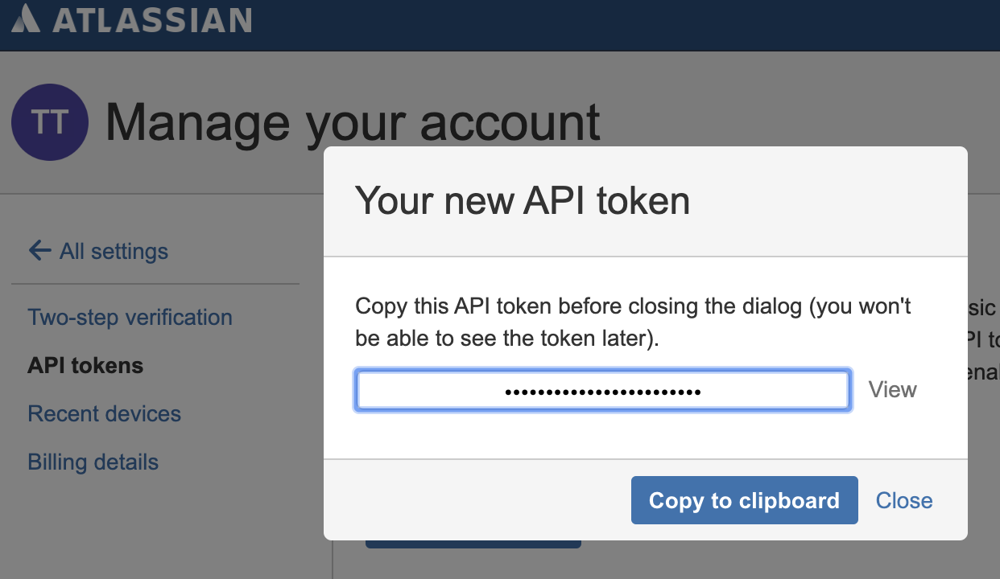
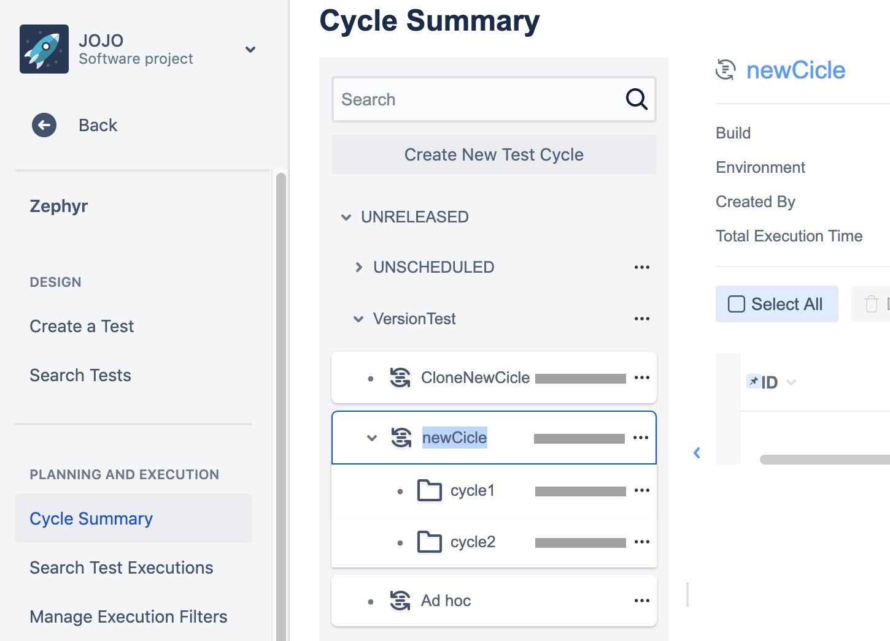
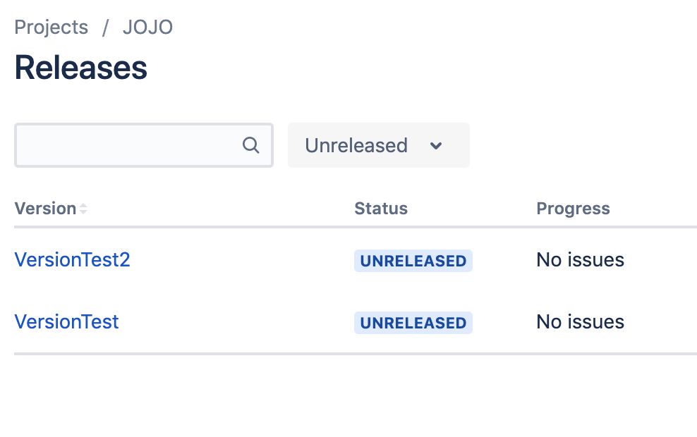
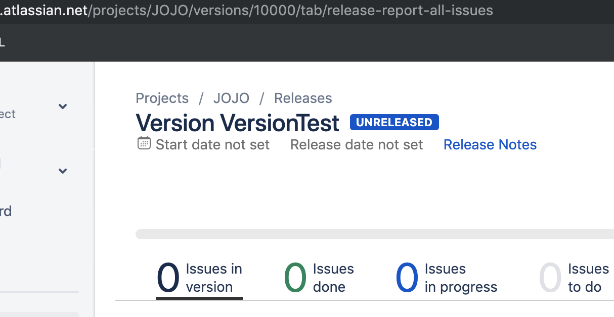
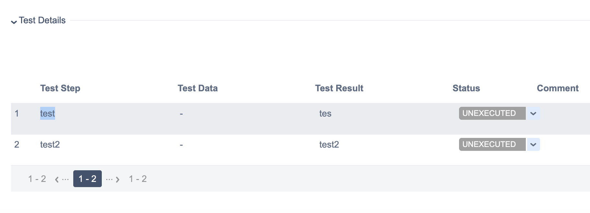

# zephyr-jira-cypress
Integration of ZAPI (Zephyr Api) with Cypress

To run it locally you need to set some variables in zephys.js file. There are credentials/api keys from your Jira account. Also as a preconditions: you need to have [Zephyr](https://marketplace.atlassian.com/apps/1014681/zephyr-for-jira-test-management) and [ZAPI](https://marketplace.atlassian.com/apps/1211674/zapi) plugins already installed in your Jira project. 

Variables to put in zephys.js file:
1. **zapiAccessKey**. To obtain ZAPI Access Key, navigate to your Jira, select Zephyr tab, then API Keys, and click to generate Api Keys. Copy Access Key.

2. **zapiSecretKey**. To obtain ZAPI Secret Key, navigate to your Jira, select Zephyr tab, then API Keys, and click to generate Api Keys. Copy Secret Key.

3. **zapiUser**. To obtain zapi User, navigate to your Jira, profile setting. Your user email, that you use to login to Jira will be used as `zapiUser` variable.

4. **jiraUserAuth**. This is API token for your JIRA user. First, you need to generate API token for your Jira user, for this navigate to `Profile - Manage your account - Security - API token` anc click on `Create and manage API tokens` then `Create API token` button. Fill the label field, and copy new generated api token. Now we need to BASE64 encode user credentials.
On Linux/Unix/MacOS: 
`echo -n test@test.com:api_token_string | base64`
where `test#test.com` is your email and `api_token_string` is the Api token that we created earlier. The output will be used as `jiraUserAuth` variable. 

5. **jiraDomain**. This is the domain of your jira project.
e.x. `https://test.atlassian.net` where `test` is your Jira ID

6. **jiraUserId**. Your jira user ID. To obtain navigate to user profile, and copy ID from URL.
e.x. `5d9dbf9310f4867c341a6a01`

7. **jiraProjectId**. The ID of Jira project. To obtain, navigate to Project tab in your jira, Project Settings, and copy Project ID from URL.
e.x. `10000`
 

 
Tests are located under Cypress/Integration folder (zephyrTest.js). 
To run test you also need to specify againts which Issue/Ticket/TestCycle you'd like to run execution.
For this you should pass some variables to executing test. The variables are:

1. **cycleName**. Zephyr Cycle Name. To obtain you should navigate to Zephyr - Cycle Summary and copy Cycle name.
e.x. `newCicle`

2. **folderName**. Zephyr folder name under Test Cycle. To obtain you should navigate to Zephyr - Cycle Summary and copy Folder name.
e.x. `cycle2`
 

3. **versionId**. Version ID of the test cases which you'd like to run. To obtain you should navigate to Jira - Releases. Click on release and copy version ID from url.
e.x. `10001`
 
 

 4. **issueKey**. This is the Jira Issue Key of the executed test. 
 e.x. for the `JOJO` project, it will be `JOJO-1`
 The full path of the issue will be something like:
 `https://test.atlassian.net/browse/JOJO-1`
 Where `test` is the your Jira ID, and  `JOJO` is the project name.

 5. **testStepName**. This is the Test Step name. User for example to fill just specific test step in Zephyr test.
 e.x. `test`
  

To open Cypress in local run `npm run cy:open` which will open Cypress locally. Select the test which you'd like to run and execute it.